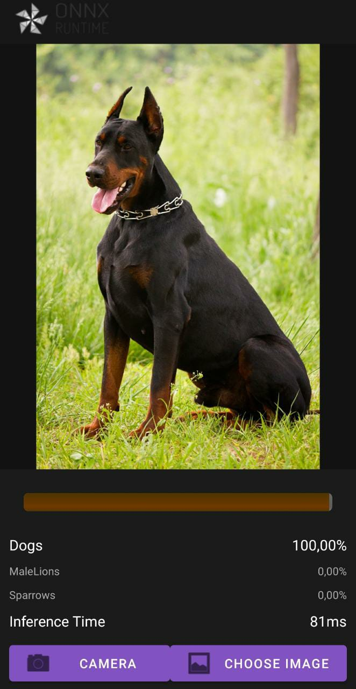
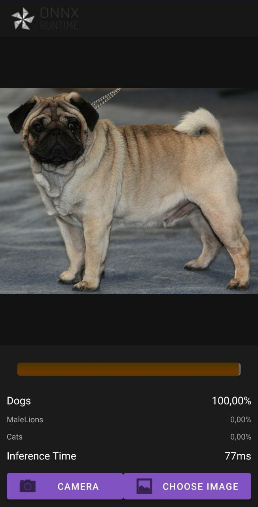
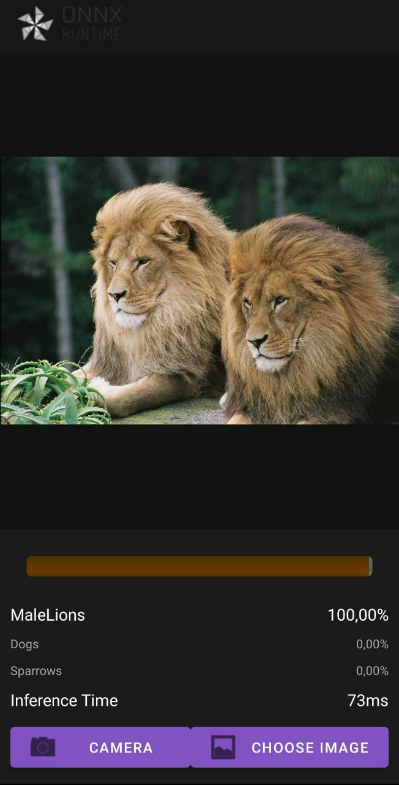
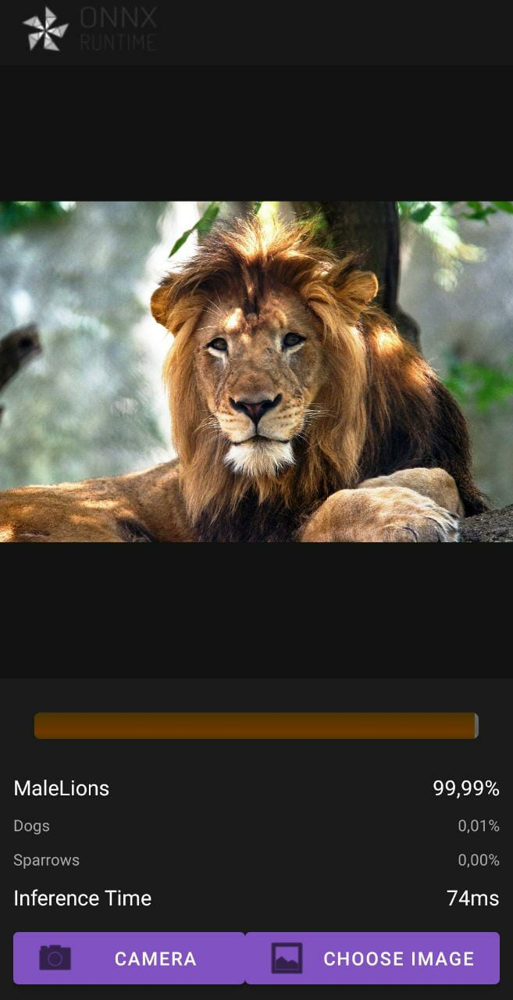
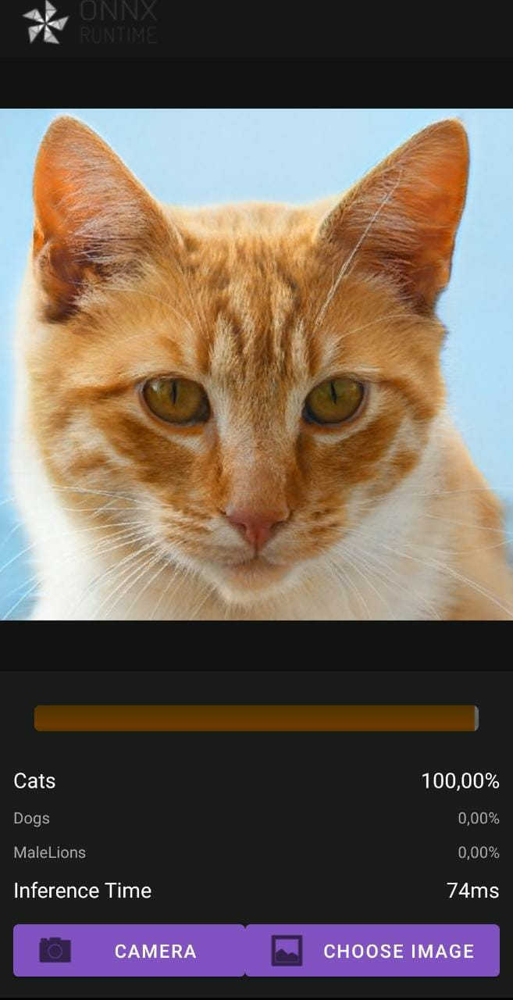
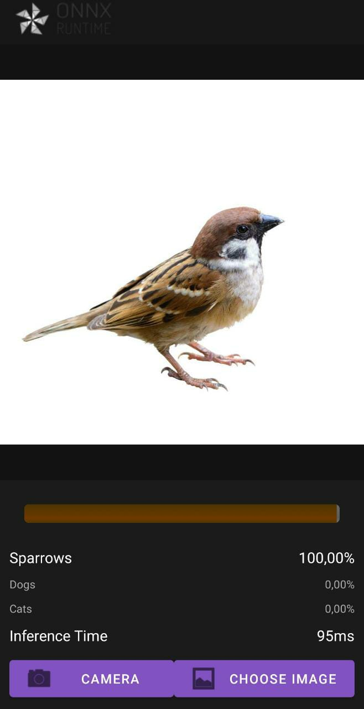

# Classificador de animais

Agradecimento especial ao usuário luizhss, por compartilhar o repositório https://github.com/luizhss/Android-Image-Classifier-App, fundamental no desenvolvimento desse projeto.

A criação do modelo de predição, foi feito inteiramente utilizando a linguagem Python. Por se tratar de um modelo que necessita de processamento gráfico, foi optado por utilizar o Google Colaboratory, que facilitaria o treinamento dessa rede, então para isso foi desenvolvido na forma de "notebook", que em sua exportação gera o arquivo com extensão .ipynb e, para execução desse app siga as instruções, que serão traduzidas do repositório do luizhss.

- Converta seu modelo para o formato ORT e cole no caminho `app/src/main/res/raw/`;
- Crie um arquivo txt com seus rótulos na mesma linha e na mesma ordem que os índices preditos e cole no caminho`app/src/main/res/raw/`;
- Vá para `app/src/main/java/ai/example/app/Mainactivity.kt` e mude nas linhas 286 e 291 com o nome do arquivo de seus rótulos e nome do arquivo de seu modelo, respectivamente.
  Você deve modificar o nome de seus arquivos de rótulos para "labels.txt" e o do seu modelo para "model.ort".
  
Utilizando um dataset pessoal, o modelo foi treinado para identificar leões machos, gatos, cachorros e pardais, veja alguns exemplos dessas predições.

    
    
    
